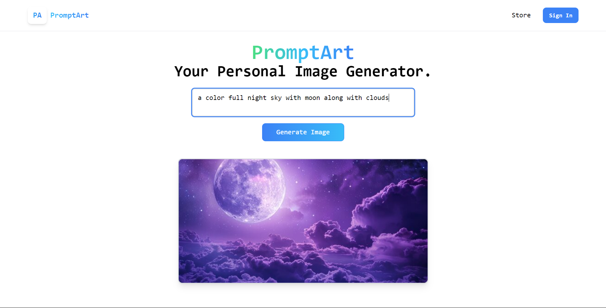

# Text-to-Image Generator 🎨



Welcome to the **Text-to-Image Generator**! This project allows users to generate images from text prompts using Stability AI's image generation API. Built with **React**, styled with **Tailwind CSS**, and enhanced with **WebSocket** integration, this app provides a seamless, real-time experience for creative exploration.

---

## 🚀 Features

- **Text-to-Image Generation**: Convert any text prompt into a stunning AI-generated image.
- **Real-Time Updates with WebSocket**: Stay connected for live image generation updates and responses, providing a smooth, interactive user experience.
- **Responsive UI**: Fully responsive design powered by Tailwind CSS.
- **Customizable Styling**: Easy to tweak and style components for a personalized touch.
- **Integration with Stability AI**: Harness the power of Stability AI for high-quality image generation.

---

## 🛠️ Tech Stack

<div align="center">
  
  
  
  
</div>

---

## Installation

To get started with the Text-to-Image Generator project:

1. Clone the repository:

   ```bash
   git clone https://github.com/your-username/text-to-image-generator.git
   ```
